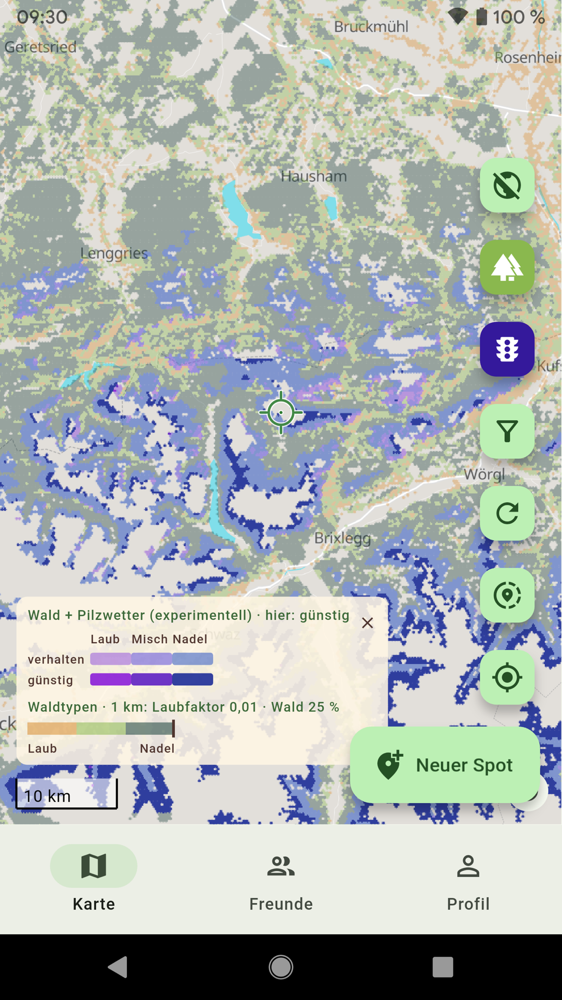
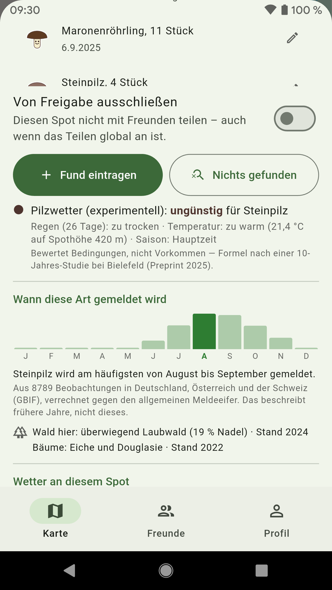
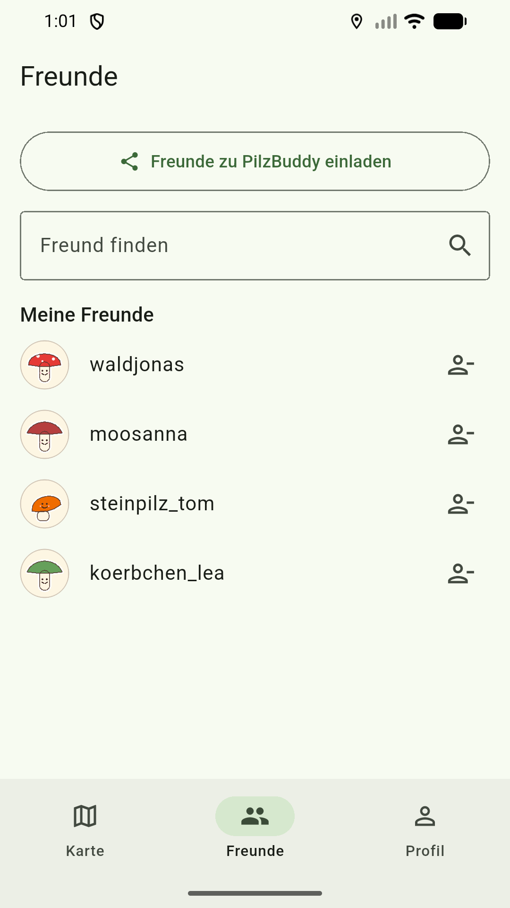
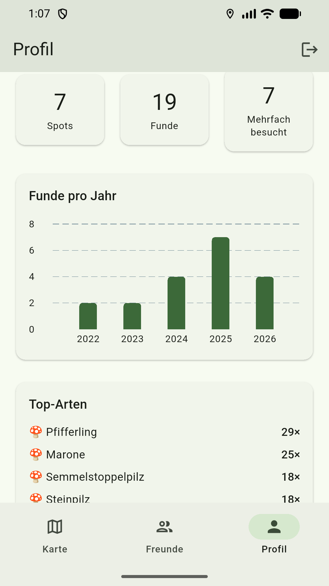
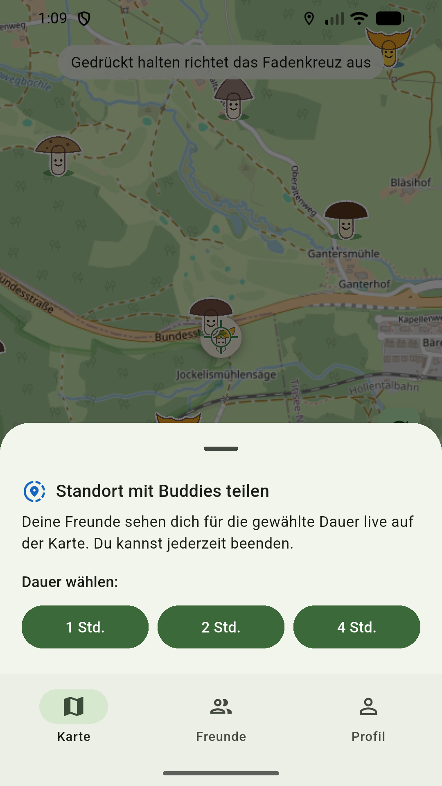

# 🍄 PilzBuddy

Pilz-Fundorte („Spots") auf einer Karte festhalten, Wiederbesuche mit zwei Taps
eintragen und Spots mit Freunden teilen.

**Plattformen:** Android (ab Android 7 / API 24) und Web (PWA)
**Web-App:** <https://macbuchi.github.io/pilzbuddy/>
**Technik:** Flutter · OpenStreetMap (`flutter_map`) · Supabase (Auth + PostgreSQL) · Riverpod

## Screenshots

| Karte mit Spots | Spot-Detail | Freunde | Statistik | Live-Standort |
|---|---|---|---|---|
|  |  |  |  |  |

## Funktionen

- **Karte:** Karte gedrückt halten → neuer Spot (Art, Anzahl, Funddatum, Notiz optional).
  Alternativ „Spot hier" für die aktuelle GPS-Position.
  Maßstab unten links; der Zoom ist auf den Bereich begrenzt, für den es
  Kartendaten gibt.
- **Filtern:** Trichter-Knopf auf der Karte → nur eine Pilzart anzeigen
  (über alle Funde einer Stelle, nicht nur den letzten) und/oder „Nur meine
  Spots". Gilt für die laufende Sitzung; ein aktiver Filter steht oben auf
  der Karte.
- **Wiederbesuch:** Marker antippen → „Fund eintragen" → Speichern.
  Art und Anzahl sind vom letzten Fund vorbelegt.
- **Freunde:** Suche per Benutzername oder genauer E-Mail, Anfrage → Annahme.
  Freundes-Spots erscheinen blau auf der Karte.
- **Live-Standort teilen:** Auf der Karte den Teilen-Button tippen → 1, 2 oder
  4 Stunden. Freunde sehen dich für die gewählte Dauer als Buddy-Avatar live auf
  ihrer Karte; die Freigabe läuft automatisch ab und lässt sich jederzeit beenden.
- **Teilen-Einstellungen** (im Profil):
  - „Meine Spots mit Freunden teilen" (globaler Standard)
  - „Auch Art, Anzahl und Funddatum teilen" — sonst nur der Standort
  - einzelne Spots lassen sich im Spot-Detail von der Freigabe ausschließen
- **Offline-Karten** (nur Android): Bundesland-Karten im Profil herunterladen,
  danach funktioniert die Karte ohne Empfang. Ohne Netz schaltet die App von
  selbst um; mit heruntergeladener Karte erscheint auf der Karte ein
  Globus-Knopf zum manuellen Wechseln.
- **Statistik:** Spots, Funde, mehrfach besuchte Spots, Funde pro Jahr,
  Top-Arten, Jahreszeiten-Verteilung.
- **Import & Export:** GPX/KML aus anderen Karten-Apps importieren, eigene
  Spots samt Fundhistorie als GPX exportieren.
- **Was ist neu:** Die Änderungsliste ([CHANGELOG.md](CHANGELOG.md)) steckt
  in der App — Profil → „Über PilzBuddy" → „Was ist neu". Mitgeliefert, also
  auch ohne Empfang lesbar.
- **Konto:** Registrierung mit Bestätigungscode aus der Mail, „Passwort
  vergessen" ebenfalls per Code, „Passwort ändern" im Profil (fragt das
  aktuelle Passwort ab), Konto-Löschung sofort und ohne Karenzzeit.

Alle Freigabe-Regeln werden serverseitig per Row-Level Security erzwungen
(`supabase/schema.sql`) — der Client kann sie nicht umgehen.

## Unterstützen

PilzBuddy ist kostenlos und ohne Werbung — und soll es bleiben. Wer
das Projekt trotzdem unterstützen möchte, kann das freiwillig über
Ko-fi tun: <https://ko-fi.com/macbuchi>. Die App bleibt für alle
gleich, Spenden schalten nichts frei.

## Entwicklung

```bash
flutter pub get

# Web (fester Port, damit die Supabase-Redirect-URL stimmt)
flutter run -d chrome --web-port 3000

# Android (Gerät/Emulator mit `flutter devices` finden)
flutter run -d <device-id>
```

## Supabase-Setup (einmalig)

1. Projekt auf [supabase.com](https://supabase.com) anlegen
2. `supabase/schema.sql` im SQL-Editor ausführen. **Das ist alles** — die
   Datei bildet den Stand nach allen bisherigen `patch_*.sql` ab und trägt
   sie am Ende selbst als eingespielt ein. Die Patch-Dateien sind für
   *bestehende* Datenbanken da und werden dort von CI eingespielt
   (`tool/db_migrate.sh`); auf einer frischen laufen sie bewusst nicht
   erneut.
3. Authentication → Sign In / Providers → Email: **„Confirm email" einschalten**.
   Ohne Bestätigung entstehen Konten auf Adressen, die niemand liest — der
   Reset-Code erreicht sie nie, und unzustellbare Mails schlagen als Hard
   Bounce auf die Absender-Reputation.
4. Project-URL + Publishable Key in `lib/core/supabase_config.dart` eintragen
   (der Publishable Key ist öffentlich; die Sicherheit liegt in den RLS-Policies)
5. Für die Konto-Mails (Bestätigung bei der Registrierung und „Passwort
   vergessen") zwei Einstellungen, ohne die beide Abläufe scheitern:
   - Authentication → Emails → **SMTP Settings**: eigenen Anbieter eintragen
     (Brevo Free reicht). Supabases eingebauter Versand liefert nur an
     Projekt-Mitglieder und ist auf wenige Mails pro Stunde begrenzt.
   - Authentication → Emails → Templates: **beide** Vorlagen auf den Code
     umstellen — **Reset Password** und **Confirm sign up**. Also
     `{{ .Token }}` anzeigen und den Link (`{{ .ConfirmationURL }}`)
     **entfernen**. Die App löst beides über den Code ein; der Link wäre an
     das anfordernde Gerät gebunden und würde beim Öffnen im Browser
     scheitern (Begründung in `CLAUDE.md`). Die versionierten Kopien der
     Vorlagen liegen in `supabase/templates/` — Änderungen gehören an beide
     Stellen.

## Mitmachen & Release-Prozess

Kein direkter Push auf `main` — Änderungen laufen so:

1. Feature-Branch von `main` (`feat/<thema>` oder `fix/<thema>`)
2. Pull Request öffnen; Commit-/PR-Titel im Conventional-Commits-Stil
   (`feat:`, `fix:`, `chore:`, `ci:`, `docs:`, `test:`, `refactor:`)
3. CI muss grün sein — sechs Pflicht-Checks: Analyze & Test, Build Web,
   Build Android APK, Version Guard, Schema Dry Run und Schema Check
4. Squash-Merge

**Release:** Die Version in `pubspec.yaml` ist die einzige Quelle der Wahrheit
(`version: x.y.z+buildNr` — bei jedem Bump beide Teile erhöhen). Landet ein
Versions-Bump auf `main`, taggt der Release-Workflow automatisch `vx.y.z`,
baut die **signierte** APK, hängt sie an ein GitHub-Release und deployt die
Web-App auf GitHub Pages. Kein Bump = kein Release (der Version Guard warnt
im PR daran zu denken).

Die APK ist mit dem PilzBuddy-Release-Key signiert — Updates lassen sich
direkt über die alte Version installieren. Die App merkt selbst, wenn ein
Release neuer ist als die installierte Version, lädt es auf Wunsch herunter
und übergibt es dem System-Installer; der Browser-Download bleibt als
Rückfallweg. Im Play-Build ist dieser ganze Pfad aus
(`AppDistribution.showsUpdateHints`). Keystore-Sicherung liegt außerhalb
des Repos (`~/pilzbuddy-keys/`); CI bezieht ihn aus den Repo-Secrets
`ANDROID_KEYSTORE_BASE64`, `ANDROID_KEYSTORE_PASSWORD`, `ANDROID_KEY_PASSWORD`,
`ANDROID_KEY_ALIAS`.

Lokale Release-Builds:

```bash
flutter build web --release     # Ergebnis in build/web
flutter build apk --release     # signiert, wenn android/key.properties existiert
```

Hinweis: Das Supabase-Free-Tier pausiert Projekte nach ca. einer Woche ohne
Zugriffe — im Dashboard lässt sich das Projekt mit einem Klick reaktivieren.

## Datenschutz

[Datenschutzerklärung](https://macbuchi.github.io/pilzbuddy/datenschutz.html)
— kurz gefasst: keine Werbung, kein Tracking, keine Analyse-SDKs. Deine Spots
sehen nur Freunde, deren Anfrage du angenommen hast. Abgeschicktes Feedback
wird mit Benutzernamen öffentlich im GitHub-Projekt veröffentlicht.

## Konto löschen

Im Profil ganz unten unter *Konto löschen* — sofort und ohne Karenzzeit.
Anleitung ohne installierte App:
[macbuchi.github.io/pilzbuddy/konto-loeschen.html](https://macbuchi.github.io/pilzbuddy/konto-loeschen.html)

## Lizenz und Datenquellen

Der Code steht unter der [MIT-Lizenz](LICENSE).

Die App verwendet Daten aus mehreren offenen Quellen — die Namensnennung
ist jeweils die Bedingung, unter der wir sie ausliefern dürfen:

- **Kartendaten:** OpenStreetMap (© OpenStreetMap-Mitwirkende,
  [ODbL](https://www.openstreetmap.org/copyright)); die Offline-Karten
  sind PMTiles der Protomaps Basemap, ebenfalls unter ODbL.
- **Regendaten:** Deutscher Wetterdienst (RADOLAN-Produkte,
  Datenlizenz Deutschland – Namensnennung – 2.0), eigene Darstellung
  und Aufbereitung.
- **Waldtypen:** © Europäische Union, Copernicus Land Monitoring
  Service, Europäische Umweltagentur (EEA) — „High Resolution Layer
  Dominant Leaf Type", zusammengefasst auf ein 250-m-Raster.
- **Saisonkurven:** gerechnet aus Beobachtungsdaten der Global
  Biodiversity Information Facility (GBIF), ausschließlich Datensätze
  unter CC0 1.0 und CC BY 4.0 — darunter SwissFungi und die
  Österreichische Mykologische Gesellschaft.
- **Kartenschrift:** Noto Sans (SIL Open Font License); der volle
  Lizenztext wird mit der App ausgeliefert.
- **Wetter-Rückrechnung** (nur Entwicklung, nicht in der App): Die
  Validierung der Pilzampel (`tool/ampel_validate.py`) nutzt
  [Open-Meteo](https://open-meteo.com) (CC BY 4.0, nur für
  nicht-kommerzielle Nutzung frei — PilzBuddy ist und bleibt kostenlos
  und werbefrei; sollte sich das je ändern, muss diese Zusage neu
  entschieden werden).

Dieselben Angaben samt Lizenztexten zeigt die App unter
*Profil → Open-Source-Lizenzen*; ein Test
(`test/flows/license_flow_test.dart`) erzwingt, dass kein
mitgeliefertes Asset ohne Lizenz-Entscheidung bleibt.
