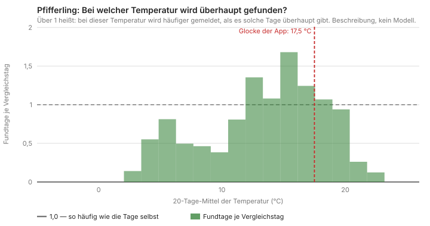
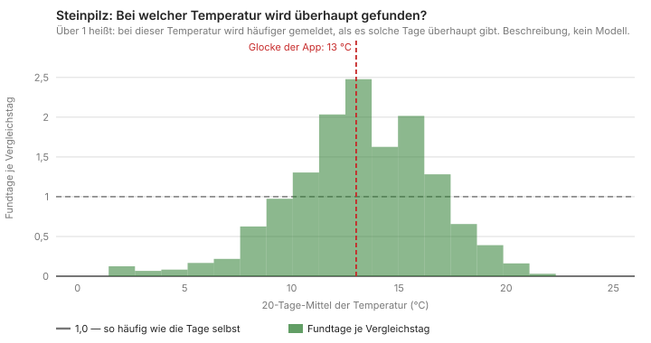
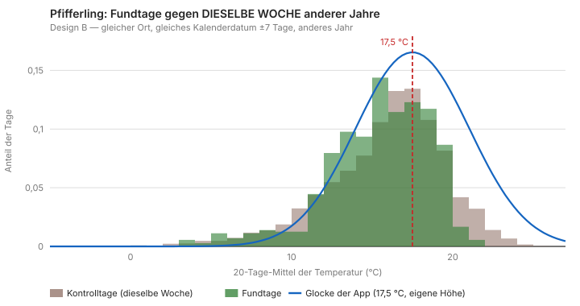
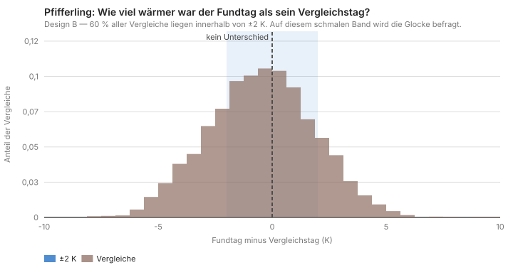
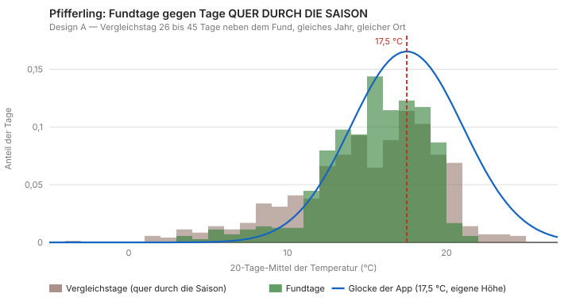
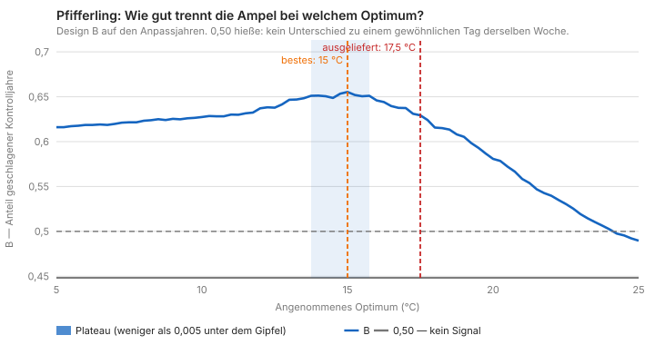
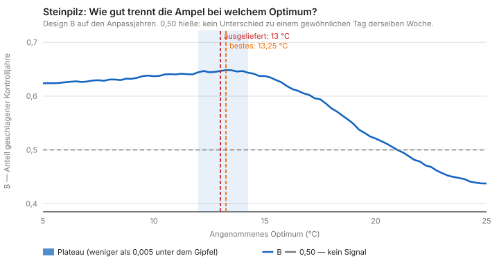

# Die Ampel in Bildern — was die Tabellen nicht zeigen

Stand: 2026-09-19 · Bilder erzeugt von `tool/ampel_diagnose.py --grafiken`
· Betreiberfrage vom 2026-09-19

**Der Anlass war ein Einwand, und er war berechtigt:** „Du willst mir
also sagen, dass auch bei −5 °C genauso viele Pfifferlinge gesichtet
wurden wie bei 10 oder 15 °C? Ich kann mir nicht vorstellen, dass es
hier gar keine Zusammenhänge gibt."

Nein, das sagen die Zahlen nicht — und dass es so klang, ist ein Fehler
der Darstellung. Diese Seite räumt ihn aus.

---

## Der Missverständnis-Kern in einem Satz

**Design B fragt eine viel engere Frage, als die Tabellen vermuten
ließen.** Es vergleicht einen Fundtag nicht mit irgendeinem Tag des
Jahres, sondern mit **demselben Kalenderdatum anderer Jahre am selben
Ort**. Die Jahreszeit kürzt sich dabei vollständig heraus — und mit ihr
der offensichtliche Zusammenhang, dass im Februar kein Pfifferling
wächst.

Ein B von 0,51 für „nur Temperatur" heißt deshalb:

> *In derselben Julwoche am selben Ort sagt die Abweichung dieses Jahres
> von der ortsüblichen Temperatur nichts darüber, ob gefunden wurde.*

Es heißt **nicht**: „Temperatur ist egal."

## Das Bild, das die Frage beantwortet





Geteilt wird der Anteil der Fundtage in einer Temperaturklasse durch den
Anteil der Vergleichstage in derselben Klasse. Über 1 heißt
überrepräsentiert.

**Der Zusammenhang ist massiv.** Beim Steinpilz steht der Gipfel bei
2,5 und die Ränder bei 0,03 bis 0,13 — ein Faktor von über 20. Beim
Pfifferling 1,7 gegen 0,13.

Und die Kurve steht nicht irgendwo:

| Art | Gipfel der Kurve | Glocke der App |
|---|--:|--:|
| Steinpilz | ~13 °C | **13,0 °C** |
| Pfifferling | ~15–16 °C | **17,5 °C** |

Beim Steinpilz sitzt die ausgelieferte Konstante genau auf dem Gipfel.
**Beim Pfifferling sitzt sie rechts davon, auf der abfallenden Flanke.**
Das ist dieselbe Aussage, die das Logit mit 13,16 ± 0,94 °C und das
Gitter mit 15,00 °C gemacht haben — nur sieht man sie hier.

**Die Grenze dieses Bildes:** Die Vergleichstage liegen 26 bis 45 Tage
neben einem Fund, sind also selbst noch saisonnah. Gegen eine
gleichverteilte Stichprobe über das ganze Jahr fiele die Kurve an den
Rändern noch steiler ab. Was hier steht, ist die **Untergrenze** des
Zusammenhangs.

## Warum die B-Tabellen davon nichts sehen



Fundtage und Kontrolltage liegen fast übereinander. Das ist kein Mangel
des Designs, sondern sein Zweck: Was übrig bleibt, ist nur noch die
Wetterabweichung dieses Jahres.



**60 % aller Vergleiche liegen innerhalb von ±2 K.** Auf diesem schmalen
Band wird die Glocke befragt. Eine Glocke mit σ = 5 K ändert sich über
2 K kaum — sie ist für diese Frage ein grobes Werkzeug.

Zum Vergleich dieselbe Art gegen Tage **quer durch die Saison**:



Hier sind die Vergleichstage breiter gestreut (Standardabweichung 4,4 K
gegen 3,2 K an Fundtagen) — deshalb trennt Design A besser, und deshalb
steckt in seiner AUC rund 0,09 Kalender
(`docs/pilzampel-kontrolldesign.md`).

## Wie flach der Gipfel wirklich ist





Das B-Maß als Funktion des angenommenen Optimums. Beim Pfifferling liegt
der Gipfel bei 15,00 (B 0,655), die ausgelieferten 17,5 bei 0,629, und
das Plateau ist 2 K breit. Beim Steinpilz liegt der Gipfel bei 13,25
(B 0,648) und die ausgelieferten 13,0 bei 0,647 — praktisch derselbe
Punkt.

**Die linke Hälfte beider Kurven ist auffällig flach.** Das ist ein
Artefakt und kein Befund: Liegt das angenommene Optimum weit unter den
tatsächlichen Temperaturen, wird die Glocke über den beobachteten
Bereich monoton fallend, und dann misst B nur noch „kühler als üblich ist
besser". Wer die Kurve liest, sollte den linken Ast ignorieren.

## Was diese Seite nicht ändert

Die Bilder sind **Beschreibungen auf den Anpassjahren** (DE bis 2018).
Sie belegen keine Hypothese und verschieben keine Konstante. Die
Antwortkurve ist kein Modell — sie wird nicht angepasst und nicht
geprüft.

Was sie ändern: die Sprache. Sätze wie „die Glocke trägt nichts bei"
gehören künftig mit der Bezugsmenge dazu — *innerhalb einer Woche am
selben Ort*. Ohne sie klingt eine enge, technische Aussage wie eine
Behauptung über Pilze, und das war sie nie.

## Erzeugung

```
python3 tool/ampel_diagnose.py --grafiken \
    --dataset pinned --dedupe \
    --api http://127.0.0.1:8080/v1/archive \
    --cache ~/pilzbuddy-ampel2000/ampel_cache_pinned
```
